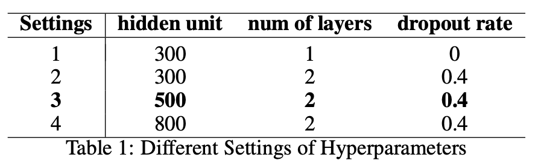
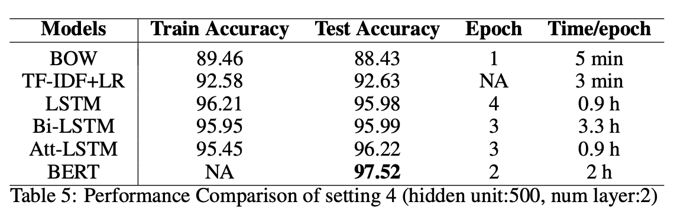

# Yelp Review Sentiment Analysis

Sentiment analysis is a popular topic in Natural Language Processing (NLP). It measures the attitude of customers towards products or services. Tremendous comments and reviews are generated every day and it is impossible to analyze them manually. Automated sentiment analysis with high accuracy help companies with decision making the product improvement. In this work, we will compare different approaches of sentiment analysis on Yelp Review Polarity data set. Methods compared include logistic regression (TF-IDF + LR), Bag of words (BOW), Recurrent Neural Network (LSTM, bi-LSTM), Attention model (LSTM + attention) and Transformer (BERT). Detailed information is included in `paper.pdf`.

# Dataset

The data set used for experiments is [Yelp Review Polarity](https://www.kaggle.com/irustandi/yelp-review-polarity/version/1#yelp_review_polarity_csv.zip). It consists reviews from Yelp with positive and negative polarity with label of 2 and 1 respectively. For each polarity, there is 280,000 training samples and 19,000 testing samples. In total, there are 560,000 training samples and 38,000 testing samples.

# Hyperparameters

The vocabulary size used for TF-IDF+LR is 4000 because larger vocabulary size would cause memory issue. We use default parameters for BERT except batch size of 110 and testing sequence length of 450. The hyperparameters below are the same for different settings of experiments for BOW, LSTM, Bi-LSTM and Att-LSTM.
* Batch size: 200
* Learning rate: 0.001
* Vocabulary size: 8000. It contains 96.35% of the data set.
* Training sequence length: 150. Mean length of reviews is 134 with standard deviation of 124. 
* Testing sequence length: 450. Longer testing sequence length yields better performance.

Besides, four settings of hyperparameters are tested. Table 1 shows the settings and best setting is bolded.

# Result

Experiment results are illustrated in Table 5. We compare all three models with baseline models BOW and TF-IDF+LR. The test accuracy of baseline models is quite high already, especially for TF-IDF+LR. It is reasonable as we have a lot of training data. It also illustrates that we can achieve acceptable sentiment classification results using only word distribution. However, we definitely need sequential information to better distinguish more complicated expressions such as phrases or metaphors.
All three models improve around 3% over baseline models which illustrates that word order information contributes to sentence sentiment classification. Att-LSTM with 500 hidden unites and 2 layers achieves best test accuracy among three models

# Description of Files
There are six folders containing the implemented models:

* __logisitic\_regression__: Run `log\_reg.py` to perform logistic regression  
* __BERT__: A finished copy is named as `BERT.ipynb` and exported as pdf with name `BERT.pdf`  
* __bow, lstm, bi\_lstm, attation\_lstm__: Each contains a *\_model.py and \_sentiment.py. *\_model.py contains the model structure and \_sentiment.py contains the training and testing process. 

 Following files are related to data preprocessing:

* `preprocess.py` would prepare the data, transform the tokens to ids and save for later use.
* `save\_data.py` would pad the data prepared by _preprocess.py_ according to the desired sequence_length and save them to numpy array.

